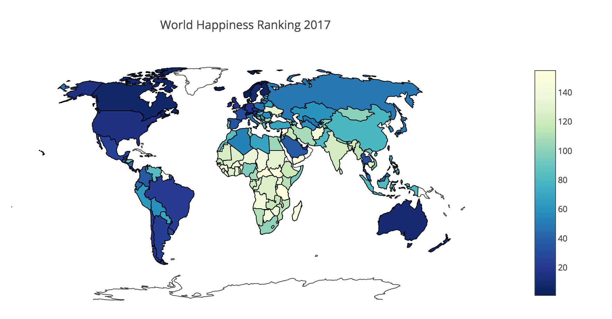

## World Happiness

### Summary
This repository contains an exploration and visualization of the [World Happiness Ranking 2017](https://www.kaggle.com/unsdsn/world-happiness) and [The World Factbook Data](https://www.kaggle.com/fernandol/countries-of-the-world) datasets. 

Happiness scores were determined by measuring the factors "GDP", "Social Support (Family)", "Life Expectation", "Freedom", "Generosity", and "Trust & Goverment Corruption".

Below is a map of the world ranking fow 2017, ranging from happiest (Norway, blue) to least happy (Central African Republic, yellow) country: 

  

### Introduction

The World Happiness report was introduced in 2012 (in support of the UN High Level Meeting on happiness and well-being) and has been released every year since, except for 2014. As the website states happiness is considered a "proper measure of social progress and the goal of public policy", and thus important to measure and analyze.  

The key variables used to explain differences in happiness among countries and through time are: 

 * income, measured by **GDP**
 * having someone to count on in times of trouble, measured by **Social Support (Family)**
 * healthy life expectancy, measured by **Life Expectation**
 * **generosity**
 * **freedom** 
 * trust, measured by the absence of corruption in business and government: **Trust & Goverment Corruption** 

In this analysis, the 2017 dataset was used, for which the complete report can be downloaded [here](http://worldhappiness.report/ed/2017/).

NB: Note that the happiness score is calculated *based on* the factors listed above. These key variables thus cannot be used to make *predictions* about hapiness scores.

### The data

In addition to the World Happiness dataset with factors income, social support (family), life expectation, generosity, freedom and trust, another dataset was leveraged. By including the World Factbook data, we can obtain extra measures for 121 of the 155 countries, and look at correlations between happiness and:

 * population size
 * area
 * population density
 * coastline
 * net migration
 * literacy
 * phones
 * arable, crops
 * climate
 * birthrate
 * agriculture, industry, service

### Findings 

As already clear from the original report, Northern European countries are the happiest in the world, and GDP is an important factor in determining happiness. By visualizing the data and correlating factors from the world factbook data with happiness, some other interesting observations were made. Summarized, high population density was not related to happiness, but low infant mortality was. Furthermore, people in certain climate types appear to be happier than others, and more phones were found in regions with higher GDPs (and higher happiness scores). Remember that correlation does not imply causation, and prediction was not the goal of this exploratory project. 

### Files in this repository 

`WorldHappiness.ipynb` contains the code for exploration and visualization of the datasets.  
`2017.csv` is a csv file with the World Happiness data of the year 2017.  
`countries of the world.csv` is a csv file with the World Factbook data.  