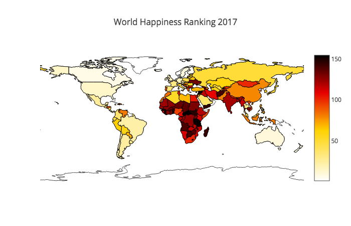

# WorldHappiness

### Summary
Short visualization of the [World Happiness Ranking 2017](https://www.kaggle.com/unsdsn/world-happiness) and [The World Factbook Data](https://www.kaggle.com/fernandol/countries-of-the-world) datasets. 

Happiness scores were determined by measuring the factors "GDP", "Social Support (Family)", "Life Expectation", "Freedom", "Generosity", and "Trust & Goverment Corruption".

